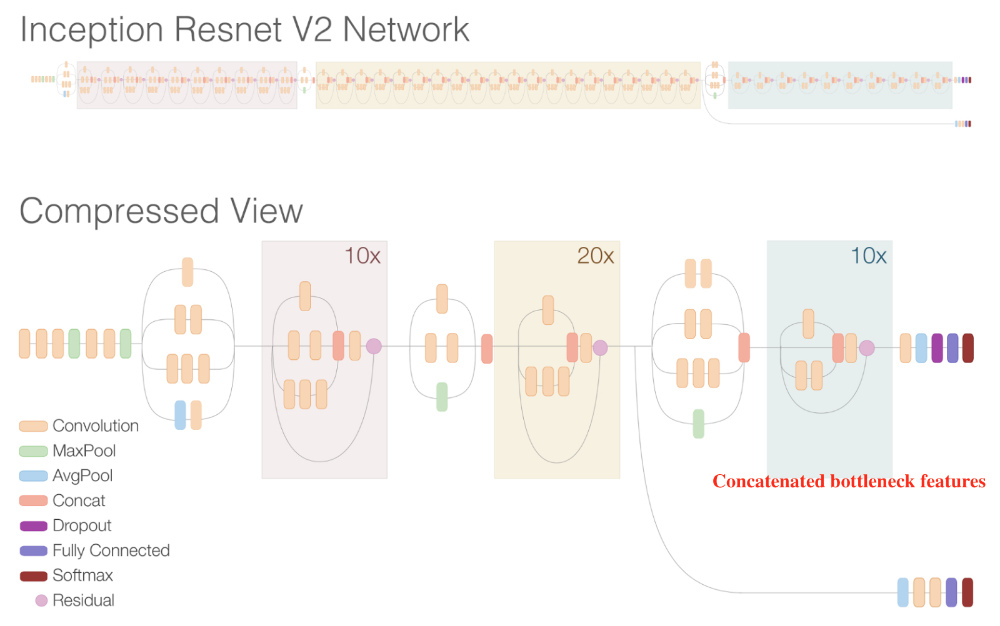

# Pathological Grade Prediction from medical imaging based on Inception-Resnet-v2

Inception-Resnet-v2 is a CNN released by Google and I recieved great help from [paper](https://arxiv.org/pdf/1602.07261v1.pdf).

Based on Inception-Restnet-v2, I use the outputs of the bottleneck layer as the extracted features and then classify these features through a dense layer.

The raw data is data about Glioma extracted from [TCIA](https://www.cancerimagingarchive.net/). TCIA is a service which de-identifies and hosts a large archive of medical images of cancer accessible for public download. The data are organized as “Collections”, typically patients related by a common disease (e.g. lung cancer), image modality (MRI, CT, etc) or research focus.
